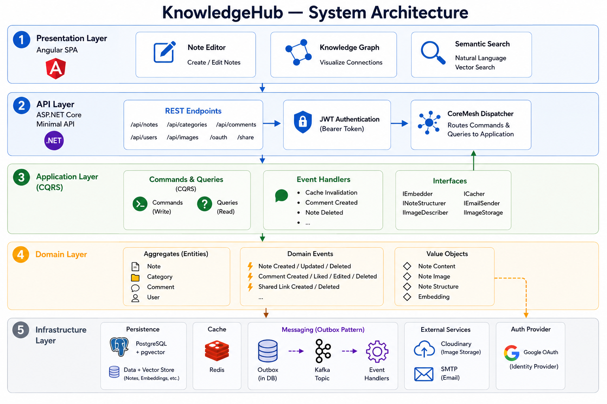
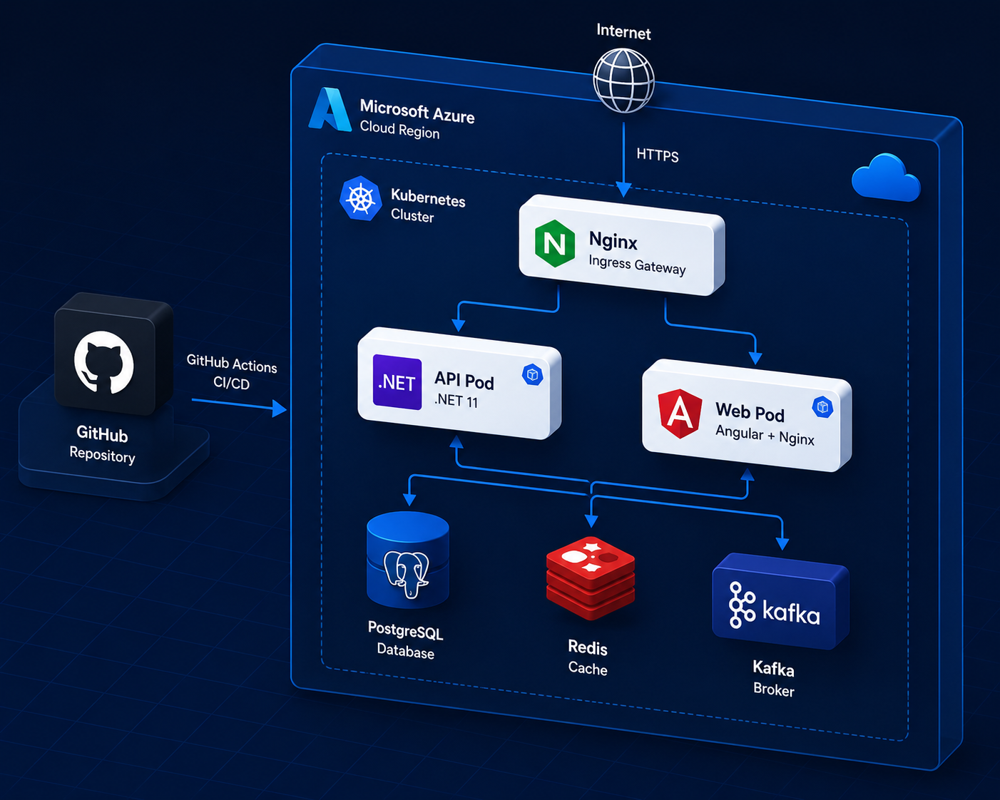
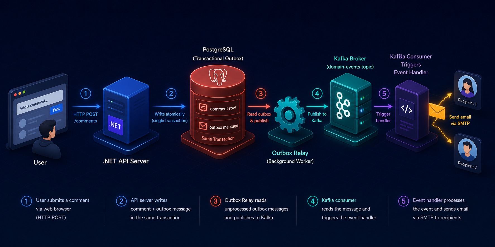

# KnowledgeHub

**AI 驅動的知識管理系統 — 寫筆記、結構化、連結你的知識。**

---

KnowledgeHub 是一個以 AI 為核心的筆記系統。用 Markdown 寫筆記，一鍵讓 AI 重整結構，透過語意向量搜尋找到相關知識，並以知識圖譜直觀看見筆記之間的連結。分享連結讓任何人閱讀留言，無需登入。

## 主要功能

- **Markdown 編輯器** — Edit / Split / Preview 三模式，自動存檔
- **AI 結構化** — 一鍵重整筆記，支援圖片自動辨識轉文字，每人每小時限制 5 次
- **語意搜尋** — pgvector 餘弦相似度搜尋，支援多 embedding provider
- **知識圖譜** — D3 force-directed 視覺化筆記連結
- **筆記分享** — 公開分享連結，支援留言與點讚，無需登入
- **LLM 鏈式降級** — Groq → Mistral → Cerebras → OpenRouter → Cloudflare → Pollinations

---

## 線上版本

用 Google 帳號登入即可使用：

**[https://davidchen.southeastasia.cloudapp.azure.com/knowledgehub](https://davidchen.southeastasia.cloudapp.azure.com/knowledgehub)**

---

## 本地開發

### 環境需求

- [Docker](https://www.docker.com/)
- [.NET 11 (preview)](https://dotnet.microsoft.com/download)
- [Node.js 22](https://nodejs.org/) + [pnpm](https://pnpm.io/)

### 1. 啟動基礎服務

```bash
cp docker/.env.example docker/.env
docker compose -f docker/docker-compose.yaml up -d
```

啟動的服務：PostgreSQL 18（pgvector）、Redis、Kafka。

### 2. 套用資料庫 Migration

```bash
dotnet ef database update \
  --project src/Infrastructure \
  --startup-project src/Api
```

### 3. 啟動後端 API

```bash
cd src/Api && dotnet run
```

API 預設跑在 `http://localhost:5000`。

### 4. 啟動前端

```bash
cd src/Presentation/Web
pnpm install && pnpm exec ng serve
```

前端預設跑在 `http://localhost:4200`。

### 環境變數

複製 `infra/k8s/.env` 作為參考：

| 變數 | 說明 |
|------|------|
| `POSTGRES_USER` / `POSTGRES_PASSWORD` / `POSTGRES_DB` | PostgreSQL 連線 |
| `DB_CONNECTION_STRING` | Npgsql 格式連線字串 |
| `REDIS_CONNECTION_STRING` | Redis 連線字串 |
| `KAFKA_BOOTSTRAP_SERVERS` | Kafka broker 地址 |
| `JWT_SECRET` | JWT 簽名金鑰 |
| `GOOGLE_CLIENT_ID` | Google OAuth Client ID |
| `CLOUDINARY_*` | Cloudinary 圖片存儲 |
| `COHERE_API_KEY` / `MISTRAL_API_KEY` / ... | AI 服務 API Key |

---

## Clean Architecture (DDD)



---

## Cloud Infrastructure




---

## Event-Driven Notifications



> **注意：** Kafka pod 需在 `spec.template.spec` 加上 `enableServiceLinks: false`，否則 Kubernetes 注入的 `KAFKA_PORT` 環境變數會導致啟動失敗。

---

## 貢獻指南

- **分支**：從 `develop` 開新分支，PR 目標為 `develop`
- **Commit 格式**：遵守 [Conventional Commits](https://www.conventionalcommits.org/)（`feat` / `fix` / `ci` / `refactor` ...）
- **後端**：保持 CQRS 結構（Handler / Command / Query 分離）
- **前端**：Angular standalone component、signal 狀態管理，禁用 `ngClass` / `ngStyle` / `@HostBinding`

---

## Known Issues

- Kafka 首次部署於 Kubernetes 時，需手動確認 `enableServiceLinks: false` 已套用
- AI 結構化依賴外部 LLM provider，若所有 provider 同時不可用則請求失敗
- 語意搜尋需先對筆記執行一次 AI 結構化，才能建立向量索引

---

## 支持這個專案

如果 KnowledgeHub 對你有幫助，歡迎贊助一杯咖啡 ☕

[](https://buymeacoffee.com)

或是給個 ⭐ Star，讓更多人看見這個專案。
